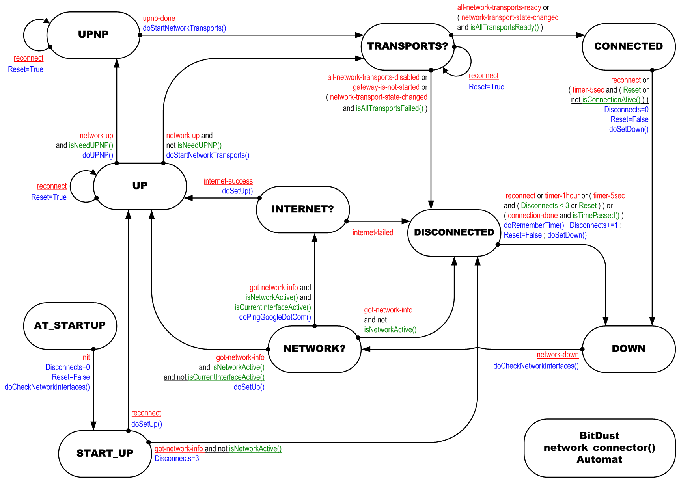

# Automat network_connector()

[network_connector.vsd](p2p/network_connector.vsd)

## Description

Automat `network_connector()` is needed to monitor the status of the connection to the Internet and start the redirection procedures on the network in various parts of the software when the network connection is subsequently restored.

In the __CONNECTED__ state, it will periodically check for the next traffic and determine the current state of the connection.

The two main methods control the switch-over:

* doSetUp()
* doSetDown()

If some network interfaces are active at the moment, but the software still can not connect to other nodes, `network_connector()` will try to ping few other nodes and decide whether there is any connection to the Internet or not.

## Events:

    * all-network-transports-disabled
    * all-network-transports-ready
    * connection-done
    * gateway-is-not-started
    * got-network-info
    * init
    * internet-failed
    * internet-success
    * network-down
    * network-transport-state-changed
    * network-up
    * reconnect
    * timer-1hour
    * timer-5sec
    * upnp-done
